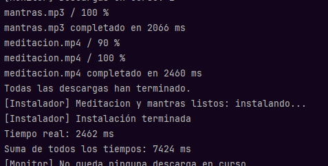
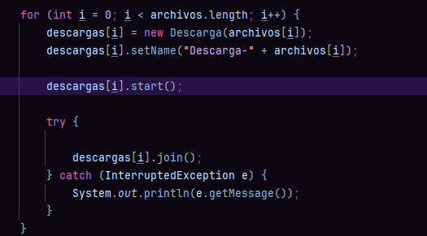
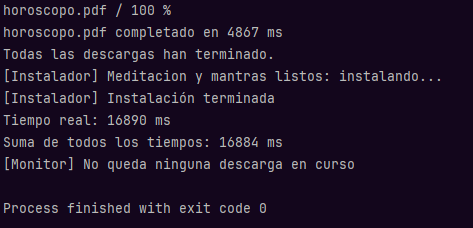
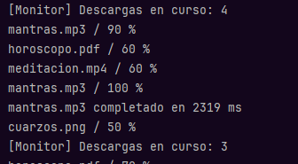
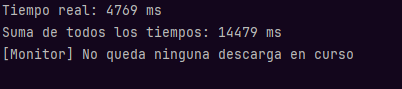
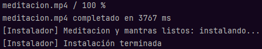
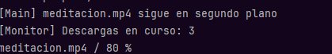

# Tarea 09 - Gestor de Descargas

## Niveles: 1, 2, 3

## Nivel 1

| Ejecución |    Descarga más lenta    | Tiempo real (ms) | Suma (ms) |
| :---: |:------------------------:|:----------------:|:---------:|
| 1 |  cuarzos.png (4667 ms)   |     4668 ms      | 13696 ms  |
| 2 |  cuarzos.png (4045 ms)   |     4046 ms      | 11398 ms  |
| 3 | meditacion.mp4 (2460 ms) |     2462 ms      |  7424 ms  |

ejemplo de ejecucion

¿Por qué el tiempo real es mucho menor que la suma?

porque al llamar start() todo los hilos se ejecutan a la vez, el tiempo real es lo que tarda la descarga mas lenta

el tiempototal suma la duracion de descarga de todos los hilos

¿Qué pasa si hacéis start() y join() dentro del mismo bucle?

Si colocas dentro de un mismo bucle for start() y join() lo que sucede es que se destruye la concurrencia y vuelve a ser secuencial, se inicia con .start() y el hilo se detiene al momento con el .join() 

| Ejecución |   Descarga más lenta    | Tiempo real (ms) | Suma (ms) |
| :---: |:-----------------------:|:----------------:|:---------:|
| 1 | horoscopo.pdf (4867 ms) |     16890 ms     | 16884 ms  |

bucle con .start() y .join() 

ejemplo de impresion

## Nivel 2

ejemplos de impresion

## Nivel 3

ejemplos de impresion

